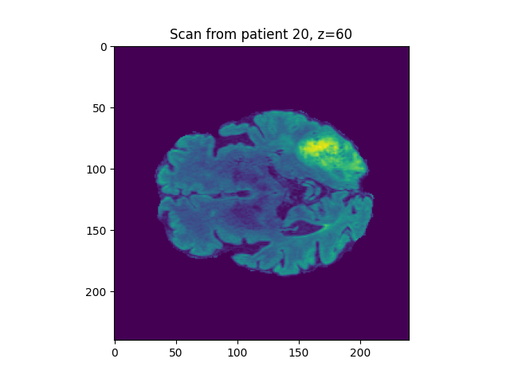

# Neuroprocessing

This repository stores examples of how hoq to code for processing of neuroimages.

Dataset 'FLAIR' obtained from biomedical-dynamics.teachable.com

This repository is made up of a series of files, using Python language:

* 'load_data.py' uploads a brain image and allows observation of the desired patient and slice, in one of planes x, y or z.




## Installation

Clone the repository using:
git clone https://github.com/lmunozbohollo/neuroprocessing.git

Ensure the following packages are installed on your device so that the code runs smoothly:
```
pip install nibabel
pip install matplotlib
pip install PyQt5
```

